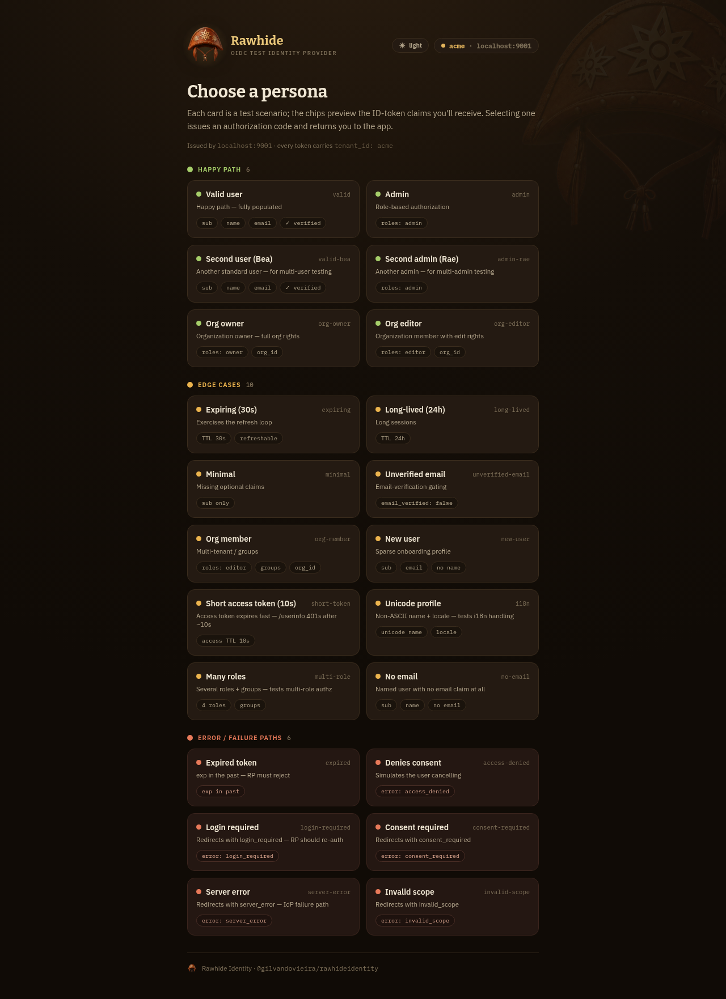
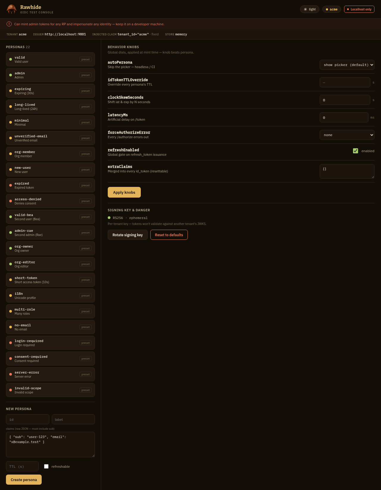
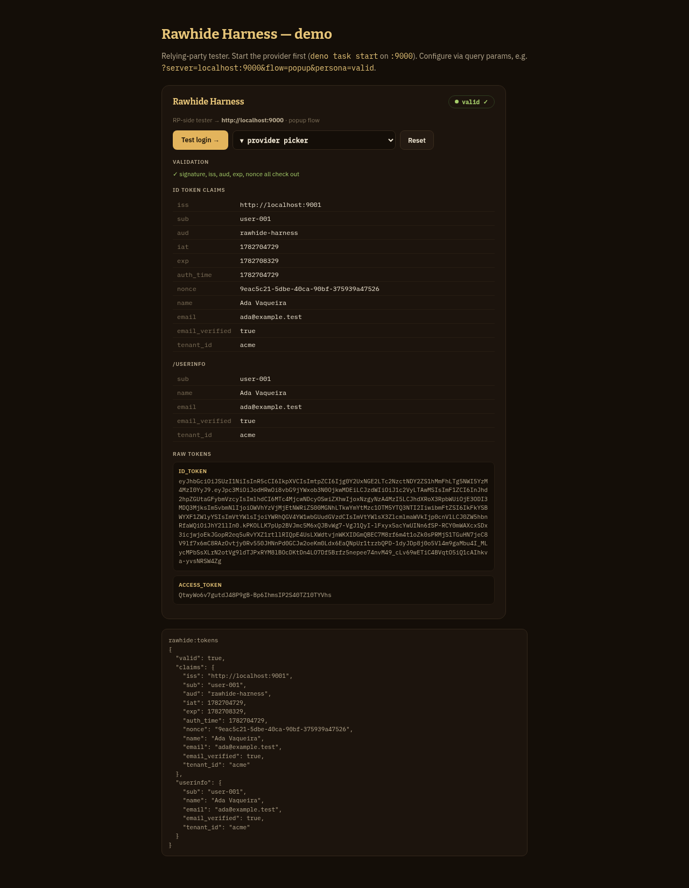

# Rawhide Identity

**`@gilvandovieira/rawhideidentity`** — a drop-in **OpenID Connect provider for local dev and
integration tests**, built on **Deno + Fresh 2.3**. A relying party (RP) redirects the browser
here, the human picks a **persona** (a test scenario), and the provider mints conformant
RS256-signed tokens and bounces back. Point `openid-client` at the issuer URL and it just works —
no pre-registration, no secrets, no real users.

> Strictly a localhost/dev tool. It will happily impersonate an admin for anyone who asks.

```bash
deno task start                 # serve on http://localhost:9000
deno task dev                   # same, with --watch reload
```

Then send your app's login through `http://localhost:9000` (discovery at
`/.well-known/openid-configuration`). No build step — it runs straight from `main.tsx`.

## Why this exists

Testing the login path of an app is usually the worst part of the test suite: you either point at a
real IdP (slow, shared, needs accounts and secrets, can't reproduce edge cases) or you stub the
token verification (fast, but now you're not testing the thing that actually breaks in production).
Rawhide is the third option — a **real OIDC provider you fully control**, on localhost, with no setup.

- **Zero setup, self-negotiating.** No client registration, no secrets, no seeded users. The RP
  discovers everything from the issuer URL; `client_id`/`redirect_uri` are accepted as-is. Point
  `openid-client` at it and the happy path just works.
- **Scenarios, not just a user.** Edge cases that are painful to produce against a real IdP are a
  click here: an already-expired token, a missing `email`, an unverified email, an admin, a
  refresh-then-expire loop, a user who cancels consent. Each preset targets one thing your RP must
  handle, so the failure modes become first-class tests.
- **Conformant tokens, real verification.** Authorization Code + PKCE, RS256 id_tokens signed with a
  rotatable key, a real JWKS. Your RP runs its genuine signature + `iss`/`aud`/`exp`/`nonce` checks —
  not a mock — so a green test means your verification actually works.
- **Runtime knobs for the hard-to-reach states.** Flip clock skew, `/token` latency, forced
  authorize errors, TTL overrides, or run fully headless (`autoPersona`) for CI — all without
  restarting or touching RP code.
- **Both sides of the handshake.** The provider is the instrumented IdP; the
  [harness](#harness-rp-side-tester) is the instrumented client, so you can exercise and inspect the
  whole flow even before your app's login code exists.
- **Faithful multi-tenant testing.** One real issuer per tenant (each with its own signing key) lets
  you test issuer routing and cross-tenant rejection for real — see [Multiple tenants](#multiple-tenants).

It is deliberately **not** a real IdP: no passwords, no consent, no production safety. That's the
point — it removes everything that makes a real IdP hard to test against, and keeps the parts your
RP integration actually depends on.

## Screens

| Persona picker (`/authorize`) | Control console (`/console`) | Harness inspector |
|---|---|---|
| [](./docs/picker.png) | [](./docs/console.png) | [](./docs/harness.png) |

## Quick start

```bash
deno task start --port 9000               # single instance
deno task start --tenant acme --port 9001 # tenant-aware (injects tenant_id, namespaces the store)
deno task start --store memory            # nothing persists — deterministic, every run starts at presets
deno task start --help                    # all flags
```

Open in a browser:

- **`/`** — landing page (endpoint index)
- **`/authorize?…`** — the persona **picker** (where RPs land)
- **`/console`** — the control **console**: author personas, flip behaviour knobs, rotate the key

### CLI flags

| Flag | Default | Meaning |
|---|---|---|
| `--port <n>` | `9000` | Port to serve on. Issuer becomes `http://localhost:<port>`. |
| `--tenant <id>` | — | Tenant-aware mode: inject a tenant claim and namespace the store file. |
| `--tenant-claim <k>` | `tenant_id` | Claim name used for `--tenant`. |
| `--store memory\|<path>` | `./.oidc-personas[.<tenant>].json` | Persona/knob store backing. `memory` persists nothing. |
| `--issuer <url>` | `http://localhost:<port>` | Override the issuer origin. |

Environment: `ISSUER=<url>` (same as `--issuer`), `CONSOLE=off` (disable `/console` entirely).

## HTTP surface

| Method | Path | Purpose |
|---|---|---|
| GET | `/.well-known/openid-configuration` | Discovery metadata |
| GET | `/jwks` | Public signing keys (RS256) |
| GET | `/authorize` | Persona picker → issues an auth code (or `&persona=<id>` to skip the picker) |
| POST | `/token` | `authorization_code` (PKCE) and `refresh_token` grants |
| GET | `/userinfo` | Claims for a Bearer access token |
| GET | `/personas` | Machine-readable persona list `[{id,label,description,scenario}]` (for the harness) |
| GET | `/relay` | postMessage relay page for the harness popup flow |
| GET | `/theme?set=light\|dark&to=<path>` | Sets the UI theme cookie, redirects back |
| GET/POST | `/console`, `/console/*` | Control console (gated off with `CONSOLE=off`) |

The JSON surface sends permissive CORS (`*`) and answers preflight, so a browser-based RP on
another origin can drive the full flow.

## Personas & knobs

A **persona** is a scenario, not just a user (a valid user, an admin, an about-to-expire token,
a denied-consent flow…). Twenty-two presets seed the store on first boot (6 happy / 10 edge / 6 error); create your own in the console
(raw-JSON claims, must include `sub`). Presets are read-only; custom personas are editable/deletable
and persist to the store file.

**Knobs** are global runtime dials applied at mint time (knob beats persona): `autoPersona`
(skip the picker — headless/CI), `idTokenTTLOverride`, `clockSkewSeconds`, `latencyMs`,
`forceAuthorizeError`, `refreshEnabled`, `extraClaims`. Plus two actions: **rotate signing key**
(new `kid`, previous kept for a grace window) and **reset** (clear custom personas + default knobs).

## Multiple tenants

If your SaaS uses a **per-tenant issuer** model (each tenant brings its own realm/IdP), simulate it
by running **one instance per tenant** — each on its own port, each a fully independent issuer with
its own `iss`, JWKS, and **signing key**:

```bash
deno task start --tenant acme   --port 9001   # iss = http://localhost:9001
deno task start --tenant globex --port 9002   # iss = http://localhost:9002
```

`--tenant` does three things beyond setting the port:

- **Injects a tenant claim** (`tenant_id: "acme"`) into every token, so tokens are self-describing.
  Rename it with `--tenant-claim org_id`.
- **Namespaces the store file** (`.oidc-personas.acme.json`) so instances never clobber each other
  (or pass `--store memory` for fully isolated, deterministic runs).
- **Badges the console/picker** so `localhost:9001` is clearly acme's.

Point each tenant context in your app at the matching issuer (acme subdomain → `:9001`, globex →
`:9002`) and you're testing the real silo plumbing: per-tenant issuer/JWKS resolution and multiple
`iss`/`aud` handling. The high-value case is the **cross-tenant negative test** — take a token from
`:9001` and assert your app accepts it in the acme context but **rejects** it in the globex context.
Because each instance signs with a different key, that rejection is genuine even if your
issuer-routing has a hole — a shared-key mock would pass and hide the bug.

```bash
# a quick launcher for several tenants
for t in "acme:9001" "globex:9002"; do
  deno task start --tenant "${t%%:*}" --port "${t##*:}" --store memory &
done
```

> Prefer the **tenant-as-claim** model (one instance, scope on `org_id`/`tenant_id`)? Run a single
> instance and assert on the claim instead. The two models exercise different parts of your auth
> layer — pick the one your product actually uses.

## Theming

Both surfaces ship a **leather/gold** theme in light and dark. Use the toggle in the header (it
sets a cookie via `/theme` — zero client JS) or pass `mode` to the components directly. Dark is the
default.

## `openid-client` note

`openid-client` enforces HTTPS by default; over plain `http://localhost` opt in with
`allowInsecureRequests` (or serve the provider behind a TLS dev proxy).

## Project layout

```
.
├── deno.json              # manifest: imports (fresh/preact/@std/cli), tasks, JSX config
├── main.tsx               # Fresh App — HTTP surface, CLI args, theme cookie, static serving (adapter)
├── core/                  # framework-agnostic OIDC core (no Fresh imports)
│   ├── oidc.ts            #   createProvider: discovery, authorize, token/exchange/refresh, userinfo, PKCE
│   ├── keys.ts            #   RS256 keypair + JWKS + JWT signing (Web Crypto), rotatable
│   ├── store.ts           #   createStore: seeded persona store + knobs (JSON file | memory)
│   ├── knobs.ts           #   Knobs defaults + FormData parsing
│   ├── presets.ts         #   the seed personas (6 happy / 10 edge / 6 error)
│   ├── types.ts           #   Persona, Knobs, Mode + scenario/chips helpers
│   └── theme.ts           #   leather/gold tokens (light + dark) → CSS variables
├── components/            # Fresh/Preact SSR screens (zero islands)
│   ├── Picker.tsx         #   persona picker (RP lands here)
│   ├── Console.tsx        #   control console (plain forms)
│   └── ThemeToggle.tsx    #   light/dark switch (cookie-based, zero-JS)
├── static/brand/          # hat logo + favicon/app-icon set (served at /brand/*)
└── harness/               # @gilvandovieira/rawhideharness — RP-side Web Component (own deno.json)
    ├── rawhide-harness.ts #   the custom element (vanilla, Shadow DOM, Web Crypto, zero deps)
    ├── demo.html          #   local demo page (reads server/persona/flow from the query)
    └── dev-serve.ts       #   tiny static server for the demo (separate origin → exercises CORS)
```

`deno.json` exposes two entry points: `.` runs the provider; `./core` exports the
framework-agnostic primitives (`createProvider`, `createStore`, the OIDC functions and types) for
embedding the issuer in your own process.

## Harness (RP-side tester)

`@gilvandovieira/rawhideharness` is a drop-in Web Component that drives this provider through a
real Authorization Code + PKCE flow, verifies the tokens (RS256 against JWKS + iss/aud/exp/nonce),
and renders an inspector — so you can test your relying-party integration without writing client
code. It lives in [`harness/`](./harness/) (its own JSR package, zero dependencies).

```html
<rawhide-harness server="localhost:9000"></rawhide-harness>
<script type="module" src="https://esm.sh/jsr/@gilvandovieira/rawhideharness"></script>
```

It emits `rawhide:tokens` (`{ idToken, accessToken, refreshToken?, claims, userinfo?, valid }`)
and `rawhide:error` (`{ stage, message }`) as bubbling/composed DOM events; `flow="popup"` (default)
or `flow="redirect"`; `headless` for events-only. See [`harness/rawhide-harness.ts`](./harness/rawhide-harness.ts).

Try it locally against a running provider:

```bash
deno task start                          # provider on :9000 (terminal 1)
cd harness && deno task bundle && deno task demo   # demo on :8080 (terminal 2)
# open http://localhost:8080/demo.html
```

## Testing

Both packages have a Deno test suite (zero external services — pure crypto + in-memory stores):

```bash
deno task test            # provider: OIDC flow, PKCE, JWKS verify, refresh, knobs, store, keys
cd harness && deno task test   # harness: b64url/JWT helpers, PKCE (RFC 7636 vector), RS256 verify
```

The provider suite mints real RS256 tokens and verifies them against the served JWKS — the same
check a relying party performs — so the tests fail if the crypto path regresses, not just the
plumbing. `deno task check`, `deno lint`, and `deno fmt --check` are also clean in both packages.

## Specs

- [`rawhideidentity.spec.md`](./rawhideidentity.spec.md) — the provider design (this package).
- [`rawhide-harness.spec.md`](./rawhide-harness.spec.md) — the harness design (built; see `harness/`).
